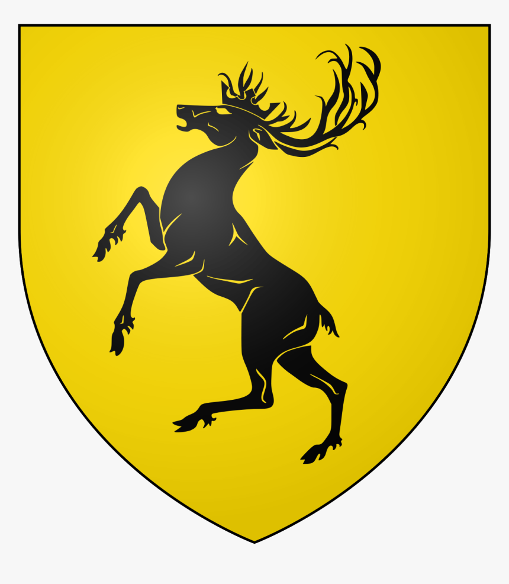

# Game of Thrones: Great Houses

## House Stark

House Stark of Winterfell is a Great House of Westeros and the royal house of the Kingdom of the North. They rule over the vast region known as the North from their seat in Winterfell. It is one of the oldest lines of Westerosi nobility by far, claiming a line of descent stretching back over eight thousand years. Before the Targaryen conquest, as well as during the War of the Five Kings and early on in Daenerys Targaryen's war for Westeros, the leaders of House Stark ruled over the region as the Kings in the North.
## House Baratheon

House Baratheon of Storm's End is a Great House of Westeros that traditionally rules the Stormlands on the eastern coast of Westeros, aptly named for its frequent storms, from their seat of Storm's End.

House Baratheon became the royal house of the Seven Kingdoms (as House Baratheon of King's Landing) after Robert Baratheon led a rebellion against the Targaryen dynasty. At the end of the rebellion, Robert ascended the Iron Throne as Robert I and married Cersei Lannister after the death of Lyanna Stark.

